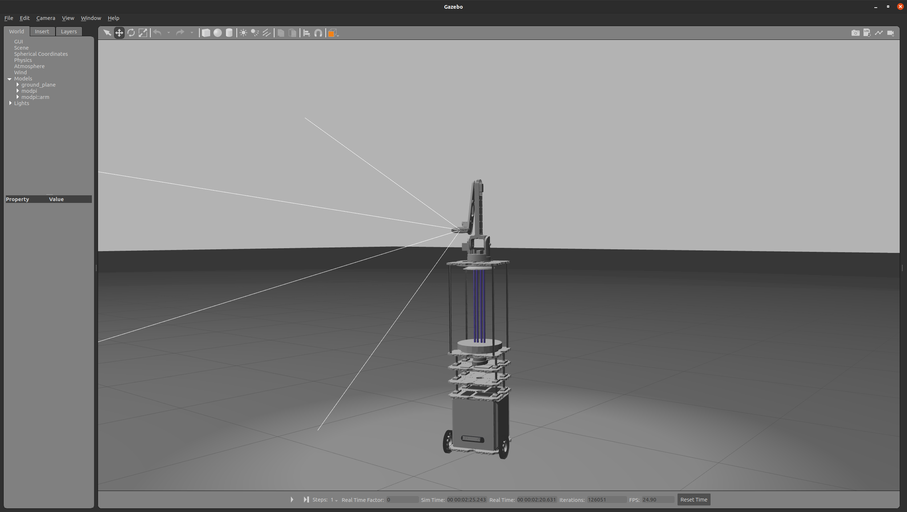
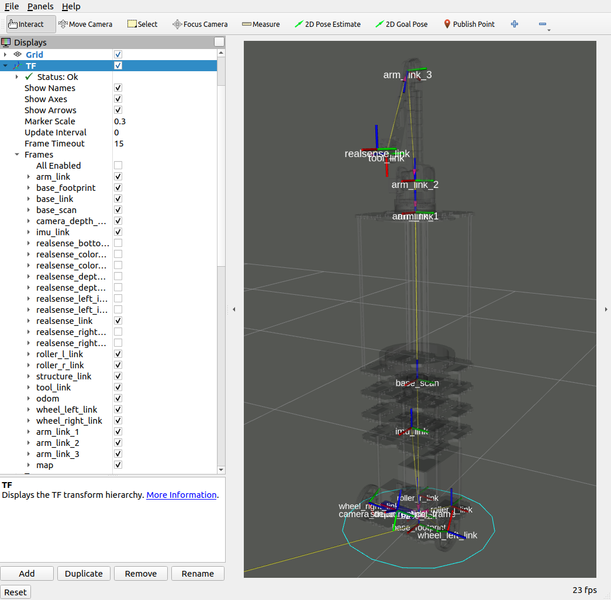
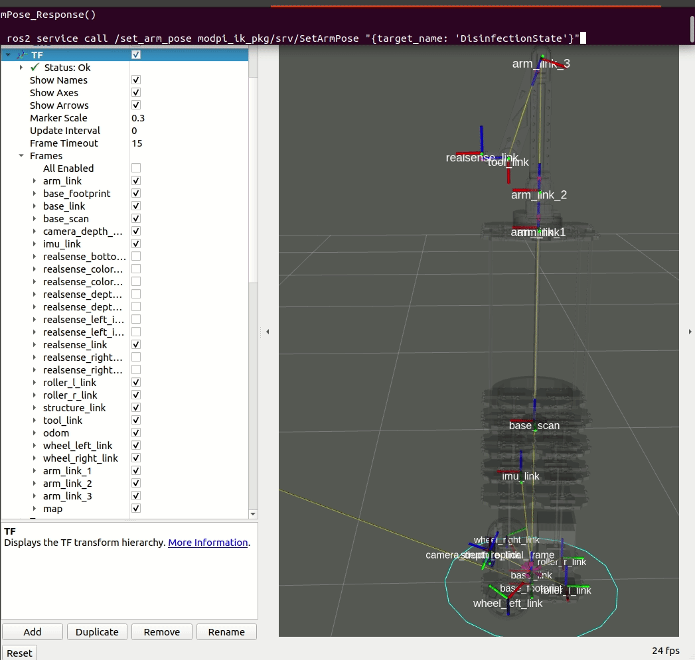
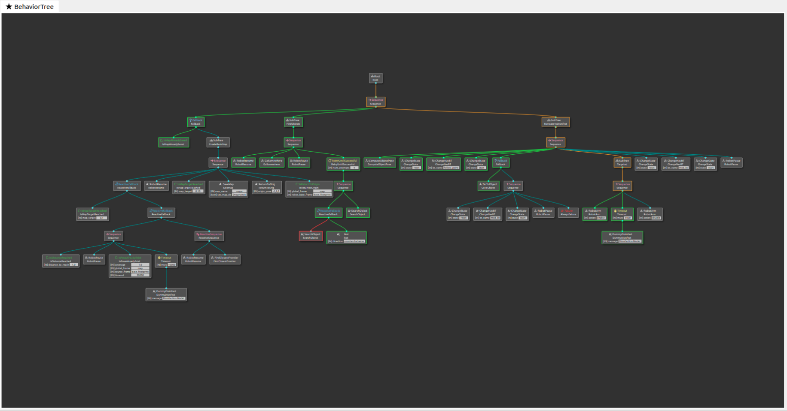
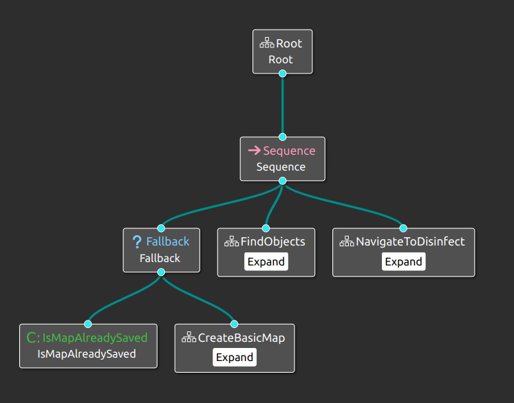
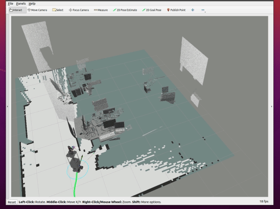
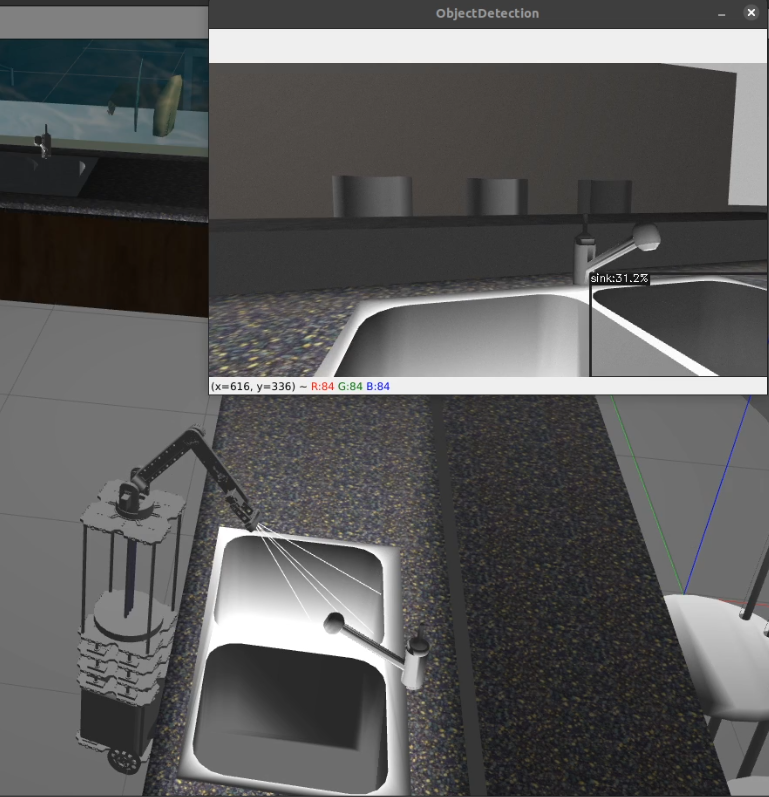
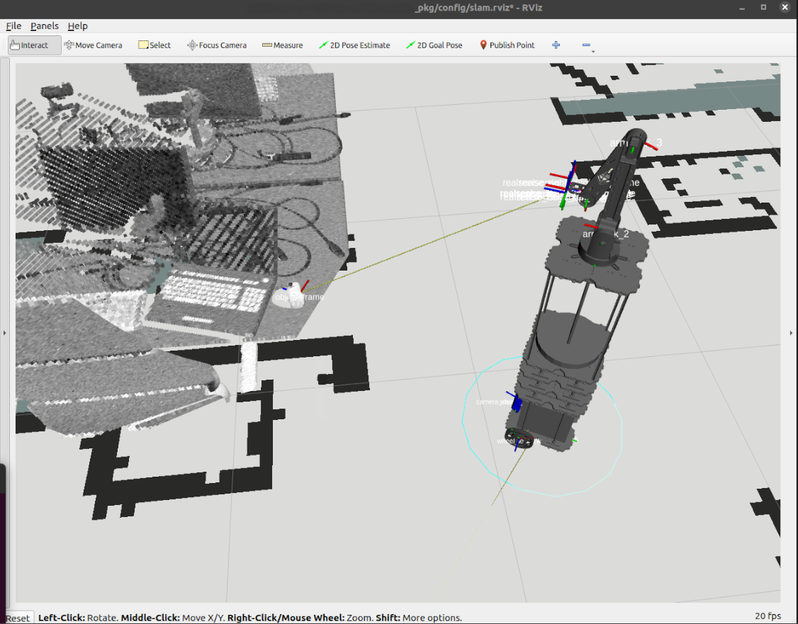

<div id="top"></div>

<!-- HEADER -->
<br />
<div align="center">
  <a>
    
  </a>
  <br />
  <h2 align="center">Turtlefied</h2>
  <p align="center">
    (Path to Autonomous Adventure)
  </p>
</div>

<!-- TABLE OF CONTENTS -->
<details>
  <summary>Table of Contents</summary>
  <ol>
    <li>
      <a href="#about">About</a>
    </li>
    <li>
      <a href="#hardware">Hardware</a>
    </li>
    <li><a href="#software">Software</a></li>
        <ul>
          <li><a href="#simulation">Simulation</a></li>
          <li><a href="#pre-requisites">Pre-requisites</a></li>
          <li><a href="#usage">Usage</a></li>
        </ul>
    <li><a href="#contributing">Contributing</a></li>
    <li><a href="#acknowledgments">Acknowledgments</a></li> 
  </ol>
</details>

<br />

<!-- ABOUT  -->
## About
__Turtlefied__ may not be Donatello's famous catchphrase, but it's got its own kind of superhero charm in the tech world. Leveraging a TurtleBot3 Waffle Pi as foundational platform to get me started in the field of robotics. 🚀🚀🚀

> **_NOTE:_** This isn't an exhaustive ROS2 tutorial;instead, the focus here is to demonstrate how this platform is capable of perceiving, executing actions and autonomously navigate which is aligned with its intended purpose.

<div align="center">
  <a>
    
  </a>
</div>
<p align="right"><a href="#top">(⤴)</a></p>

<!-- HARDWARE -->
## Hardware
Turtlefied consists of:
* Of course! A Turtlebot3 Waffle pi, the parts were used are;
  * Dynamixel Motors
  * [OpenCR Module](https://emanual.robotis.com/docs/en/parts/controller/opencr10/) (ARM Cortex-M7)
  * waffle plates
* Raspberry Pi 4B
* RPLidar-A2 (A cool 360° 2D-Laser Scanner)
* Structure Sensor (just added this for additional voxel layer to improve obstacle avoidance, come on! we cannot afford a 3D Lidar)
* Lithium Battery (11Ah)
* The 4-DOF robot arm consist of;
  * Arduino module
  * Servo Motors
  * Jetson Module (sadly, the RPI cannot do all the work)
  * Intel Realsense (A very cool RGB-D Camera)
* Tyres, Robot Arm and other parts are PLA printed (Thanks to my hardware colleagues!) 😊

> **_NOTE:_** I can't display the real robot since it doesn't belong to me. This is where the 
<a href="#simulation"> next part</a> shines because it's essentially a perfect replica!!!
<p align="right"><a href="#top">(⤴)</a></p>

<!-- SOFTWARE -->
## Software
Turtlefied runs ROS2 Galactic version on Ubuntu 20.04. All the packages within this repository have been developed, hence, any changes I made to the specific packages<a href="#acknowledgments"> (see acknowledgements section)</a> are excluded.
The package includes functions such as bringing up the mobile robot, to SLAM, Navigate and a simple arm control using a behavior-tree based system.
I also include the Collada and STL files in case you want to simulate.

RViz2 is a 3D robot visualizer that simplifies development and debugging tasks. For instance, it's useful for inspecting URDF constructions.
you can also teleoperate turtlefied by executing the command in your terminal, when the node (/teleop_keyboard) is running, Just follow the given instructions in your terminal, and you'll be able to control the robot.
```
ros2 run turtlebot3_teleop teleop_keyboard
```


### Simulation
Thanks to Robotics community 🤖🤖🤖!!! you can still benefit because you won't have to be concerned about the costs and challenges of building a physical robot. Instead, you can simulate an identical replica in a virtual environment, which is often more budget-friendly and accessible for learning and experimentation.

### Pre-requisites
Here are the necessary installations to recreate the setup.

* __For Simulation:__
  * Setup the [Ubuntu 20.04](https://ubuntu.com/tutorials/install-ubuntu-desktop#1-overview) + [ROS2 Galactic](https://docs.ros.org/en/galactic/index.html)
  * Setup [Gazebo]()
* __For the Physical Robot Setup__
  * Install Ubuntu 20.04 + ROS2 Galactic on Raspberry Pi(there's actually an [image file from robotis](https://emanual.robotis.com/docs/en/platform/turtlebot3/sbc_setup/#download-turtlebot3-sbc-image) that you can use on the go). I'll include the [manual SBC installation](https://emanual.robotis.com/docs/en/platform/turtlebot3/sbc_setup/#sbc-setup) here as well.
  * [OpenCR](https://emanual.robotis.com/docs/en/platform/turtlebot3/opencr_setup/#opencr-setup) Setup
  * RPLidar & Structure Sensor Drivers and ROS2 Wrappers
* __For both setup__
  * [Realsense](https://github.com/IntelRealSense/realsense-ros#installation) SDK & ROS2 Wrapper
  * Navigation2, Slam Toolbox, Exploration

### Usage

    # bringup all the required nodes
    ros2 launch turtlefied_pkg bringup.launch.py

    # the node that handles task execution using a behavior-tree 
    ros2 run turtlefied_pkg bt_decision

__Let's visualize with Behavior Trees__

Finite-State Machines are great for designing software systems but Behavior Trees recently, gained its popularity in the field of robotics, if you are interested in exploring this trend, you might want to start with this really [good documentation](https://www.behaviortree.dev/docs/intro) and start creating your own bt nodes!

  

* Turtlefied is built for task execution as demonstrated by the following bt image below;
<div align="center">
  <a>
     
  </a>
</div>

  * "IsMapAlreadySaved" is a Condition Node responsible for verifying whether a map has already been constructed or built.
  * Subtrees:
    * "CreateBasicMap" is a Subtree responsible for autonomously handling mapping and navigation until the map percentage target is achieved.
    * "FindObjects" with a basic map known, turtlefied will randomly traverse locations within a map in search of objects of interest.
    * "NavigateToDisinfect" this task involves navigating to the object and then performing disinfection.


__Let's visualize SLAM and Navigation__

Essentially, __Localization__, __Mapping__ and __Navigation__ are the core of robotics that enables it to understand its environment, determine its estimate location within the environment, and autonomously navigate through it. These capabilities are fundamental for tasks such as path planning, obstacle avoidance, exploration, and interaction with the surroundings.

 

__Let's visualize the Robot Arm__

A big shout-out to my hardware colleagues for designing this robot arm! Without the CAD, I wouldn't be able to make the joints move and carry out the tasks I require. 👏👏👏
* The following are super helpful for me in learning how to make this robot arm dance.:
  * Fusion 360 (just the free version)
  * arduino firmware
  * driver (because I let arduino talks to rpi via serial)
  * ros2 wrapper (for creating bridge/interface between ros2 and driver)

   

An __object pose estimation__ node is created as well, to visualize where is the object with respect to the camera frame.

<div align="center">
  <a>
    
  </a>
</div>
<p align="right"><a href="#top">(⤴)</a></p>

<!-- CONTRIBUTING -->
## Contributing
Hi there! I am new to this. I just learned that open source creates numerous opportunities and is an excellent place to find inspiration and broaden your knowledge by collaborating with brilliant minds from around the world! therefore, pull request are welcome and accepted.

if you like this project give it a star ⭐ and feel free to hire me! 😂😂😂 seriously.

__Future Work__
* migration to humble
* fusing sensors to improve odometry
* add android UI
* moveit2 is really interesting, I want to use its path planning for the arm
* get rid of frontier search exploration, because the goal is only to disinfect objects in search while mapping
<p align="right"><a href="#top">(⤴)</a></p>

<!-- ACKNOWLEDGMENTS -->
## Acknowledgments

* [ROS 2 Documentation - Galactic](https://docs.ros.org/en/galactic/index.html).
* [Gazebo - Open Robotics](https://gazebosim.org/home).
* [Turtlebot3 Documentation - ROBOTIS](https://emanual.robotis.com/docs/en/platform/turtlebot3/overview/).
* [Slam ToolBox - Steve Macenski](https://github.com/SteveMacenski/slam_toolbox).
* [Frontier Exploration - robo-friends](https://github.com/robo-friends/m-explore-ros2).
* [Behavior Trees Documentation - Auryn Robotics](https://www.behaviortree.dev/docs/intro).
* [object detection package - Ar-Ray](https://github.com/Ar-Ray-code/YOLOX-ROS).
* [README.md template - Othneil Drew](https://github.com/othneildrew/Best-README-Template).

Huge thanks to my employer and my project manager for letting me play and enjoy this "toy", Their generosity keeps my coding gears turning, and I couldn't be more thankful. 😄🚀
<p align="right"><a href="#top">(⤴)</a></p>